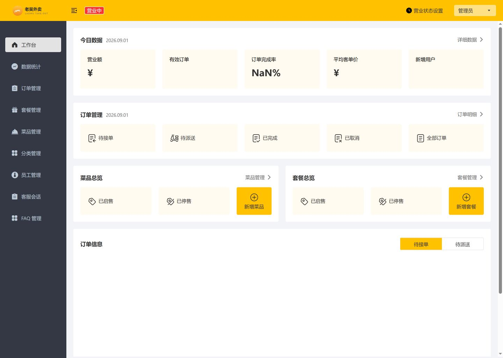
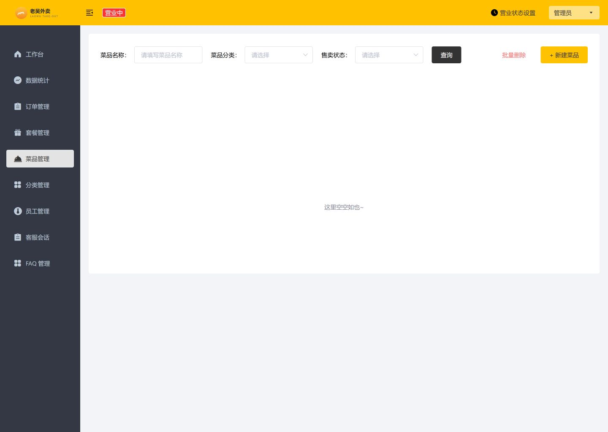
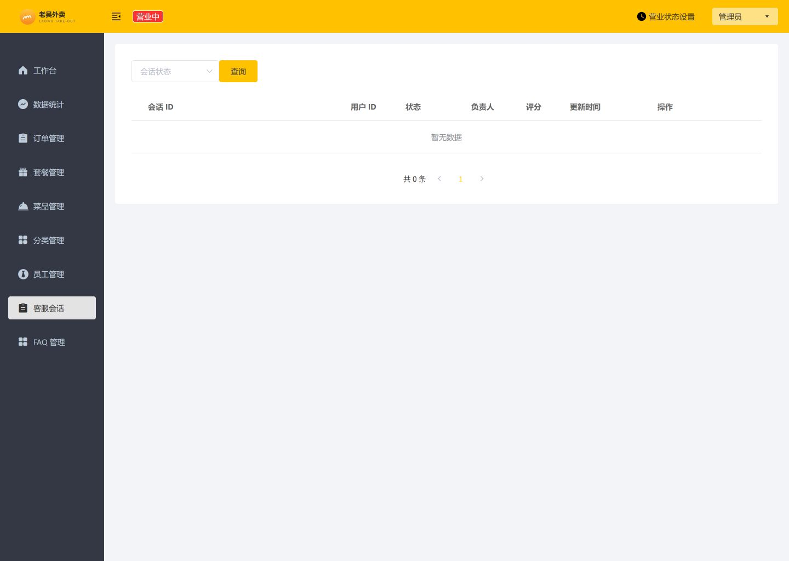
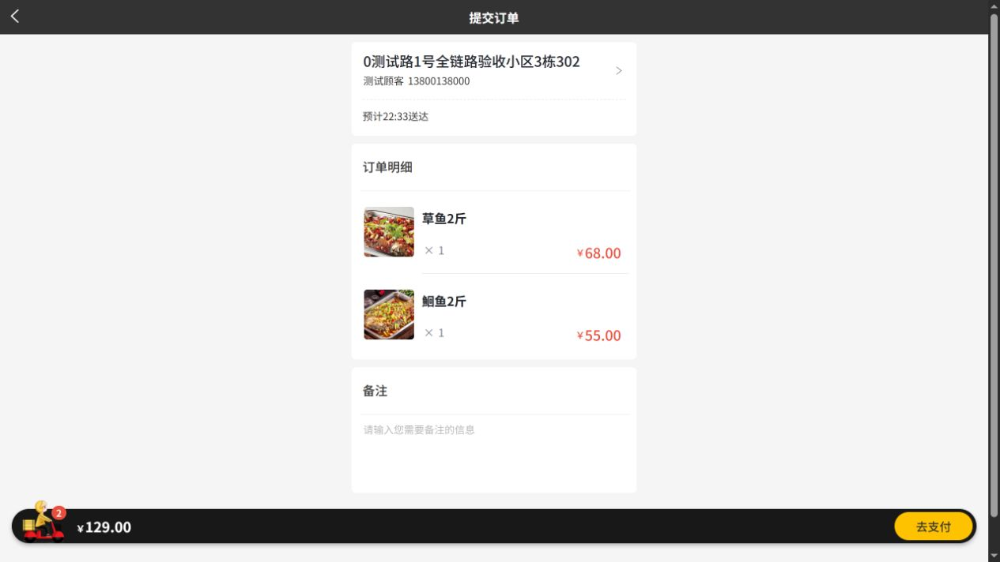
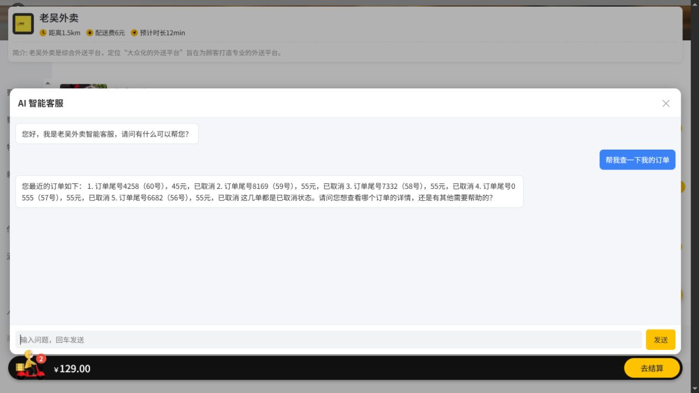
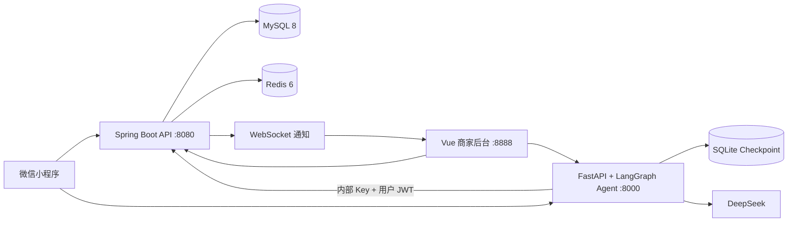

# 老吴外卖 · AI 客服驱动的全链路外卖系统

一个可以真正跑起来、可以完整验收、也能讲清楚安全边界的外卖作品集项目。

它包含微信小程序顾客端、Vue 商家后台、Spring Boot 业务后端和 FastAPI + LangGraph AI 客服。用户可以完成“浏览菜品 → 下单 → Mock 支付 → 商家接单 → 配送 → 催单 → 退款 → 评价”的完整流程；AI 客服可以查询真实业务数据，但取消、退款、再来一单等高风险动作必须经过确认节点。

> 核心原则：**模型负责理解意图，后端代码负责权限、状态和数据修改。**

<p align="center">
  <a href="https://github.com/wbc949440300/laowu-takeout/actions"></a>
  
  
  
  
</p>

## 先看结果

| 可验证结果 | 当前基线 |
| --- | --- |
| 完整业务 E2E | **49/49 通过** |
| Agent 单元测试 | **40 passed** |
| Java 测试 | `mvn test` 通过 |
| 管理后台 | Vue 生产构建通过 |
| 本地服务 | Java `8080` · Agent `8000` · 管理后台 `8888` |

## 黄金体验路径

```text
小程序登录
  → 浏览菜品 / 加购物车 / 领取优惠券
  → 下单 / 开发环境 Mock 支付
  → AI 客服查询订单
  → 管理后台接单 → 派送 → 完成
  → 小程序催单 → 管理后台 WebSocket 实时提醒
  → 申请退款 → 商家审核 → 订单状态更新
  → AI 取消订单确认节点 / 注入防护
```

完整的逐步操作手册在：[完整启动与全链路验收.md](sky-take-out/docs/完整启动与全链路验收.md)

## 项目截图

截图来自本地运行环境和测试数据库，展示的是实际页面，不是设计稿。后台截图使用 1440×1024 宽视口采集，避免窄屏裁切。

### 商家后台

<table>
  <tr>
    <td width="50%"><br><sub>工作台：营业额、有效订单、待接单和菜品概览</sub></td>
    <td width="50%"><br><sub>订单管理：按状态查看并推进履约</sub></td>
  </tr>
  <tr>
    <td width="50%"><br><sub>菜品管理：库存、起售/停售和图片</sub></td>
    <td width="50%"><br><sub>客服会话：AI 会话审计与处理入口</sub></td>
  </tr>
</table>

### 顾客端（uni-app H5 本地运行）

顾客端截图来自本地 H5 构建和测试数据库，覆盖首页浏览、订单确认和 AI 客服问答三个独立状态；微信小程序真机运行需要合法 AppID 和开发者工具权限。

<table>
  <tr>
    <td width="50%"><br><sub>首页：分类、真实菜品、价格和购物车状态</sub></td>
    <td width="50%"><br><sub>提交订单：地址、订单明细、备注和 Mock 支付入口</sub></td>
  </tr>
  <tr>
    <td width="50%"><br><sub>AI 客服：欢迎语与真实订单查询结果</sub></td>
    <td width="50%"></td>
  </tr>
</table>

## 我做了什么

### 完整业务闭环

- 菜品、套餐、购物车、地址、优惠券、订单、评价和配送员管理
- 订单状态机约束 `待付款 → 待接单 → 已接单 → 派送中 → 已完成`
- 催单记录、订单时间线、退款申请与审核状态
- 开发环境提供 Mock 登录和 Mock 支付，便于本地和 CI 重复验收

### AI 客服不是“套壳聊天框”

- LangGraph 管理多轮会话和工具调用
- 查询订单、订单时间线、菜品、套餐、营业状态和退款进度都来自后端真实接口
- FAQ 支持后台 CRUD、检索阈值和缓存刷新
- 取消、退款、再来一单等写操作先暂停在确认节点，用户拒绝时不执行
- 提供 SSE 流式接口、会话列表、反馈、审计和管理员只读报表工具

### 安全边界由代码兜底

- 用户和管理员使用两套 JWT 与不同请求头
- 订单归属由 Java 后端校验，Agent 不直接连接 MySQL
- `/internal/**` 使用内部 Key，并可叠加 IP 白名单
- 结构化错误、Trace ID、限流、健康检查和就绪检查便于定位问题
- 自动化用例覆盖越权、无 Token、提示词注入和高风险确认节点

## 系统架构



Agent 不直接读写业务数据库。它只能通过受保护的内部接口获取聚合数据或请求业务动作；最终能不能执行，由后端的权限校验、订单归属和状态机决定。

## 关键设计取舍

| 问题 | 选择 | 原因 |
| --- | --- | --- |
| Agent 为什么不直连数据库？ | 统一走 Java 内部接口 | 让订单归属、状态流转和审计只有一个可信入口 |
| 为什么高风险动作要确认？ | LangGraph interrupt | 模型误判或提示词注入时，不能直接修改订单 |
| 为什么支付默认 Mock？ | dev 开启 Mock，prod 关闭 | 不把真实凭证放进仓库，同时保证业务闭环可重复演示 |
| 为什么用 SQLite checkpoint？ | 单机演示阶段使用 SQLite | 零额外依赖；多实例共享存储列入后续路线图 |

## 技术栈

| 模块 | 技术 |
| --- | --- |
| 业务后端 | Java 8、Spring Boot 2.7、MyBatis、MySQL 8、Redis 6、JWT、WebSocket、Knife4j |
| AI 客服 | Python、FastAPI、LangGraph、LangChain、DeepSeek、SQLite、SSE |
| 管理后台 | Vue 2、TypeScript、Element UI、ECharts、Vue CLI |
| 用户端 | uni-app、微信小程序 |
| 部署 | Docker Compose、Dockerfile、GitHub Actions |

## 目录结构

```text
laowu-takeout/
├─ sky-take-out/
│  ├─ sky-common/       通用类、异常、支付工具
│  ├─ sky-pojo/         实体、DTO、VO
│  ├─ sky-server/       Controller、Service、定时任务、WebSocket
│  ├─ sky-agent/        FastAPI + LangGraph Agent
│  ├─ db-init/          数据库初始化脚本
│  └─ docker-compose.yml
├─ sky-web/             Vue 2 + TypeScript 商家后台
├─ sky-miniapp/         uni-app 微信小程序
├─ docs/                截图与测试报告
└─ .github/workflows/   CI：Agent、Java、前端、密钥扫描
```

## 快速开始

### Docker 启动后端和 Agent

需要 Docker Desktop。先在 `sky-take-out/sky-agent/.env` 配置本地 `DEEPSEEK_API_KEY`，再执行：

```powershell
cd sky-take-out
docker compose --env-file sky-agent/.env up -d --build
```

### 本机启动

1. 启动 MySQL 和 Redis：

```powershell
cd sky-take-out
docker compose up -d mysql redis
```

2. 启动 Java。推荐 IDEA 运行 `com.sky.SkyApplication`；如果 Maven 聚合项目无法识别主类：

```powershell
mvn -pl sky-server -am package -DskipTests
java -jar sky-server\target\sky-server-1.0-SNAPSHOT.jar --spring.profiles.active=dev
```

3. 启动 Agent：

```powershell
cd sky-agent
.venv\Scripts\python.exe -m uvicorn app.main:app --host 127.0.0.1 --port 8000
```

4. 启动管理后台：

```powershell
cd ..\..\sky-web
npm ci
$env:NODE_OPTIONS="--openssl-legacy-provider"
$env:VUE_APP_URL="http://localhost:8080"
npm run serve
```

5. HBuilderX 导入 `sky-miniapp`，运行到微信开发者工具。开发环境不需要真实微信支付即可体验闭环。

服务地址：

- 管理后台：<http://localhost:8888>
- Java 健康检查：<http://localhost:8080/health>
- Java 接口文档：<http://localhost:8080/doc.html>
- Agent 文档：<http://localhost:8000/docs>
- Agent 就绪检查：<http://localhost:8000/ready>

## 测试与验收

```powershell
# Agent 单元测试
cd sky-take-out\sky-agent
.venv\Scripts\python.exe -m pytest -q

# Agent 专项与完整链路（会写入测试数据库）
$env:PYTHONIOENCODING="utf-8"
.venv\Scripts\python.exe tests\e2e_agent_final.py
.venv\Scripts\python.exe tests\e2e_full.py

# Java 测试
cd ..
mvn test -q

# 管理后台构建
cd ..\..\sky-web
$env:NODE_OPTIONS="--openssl-legacy-provider"
npm run build
```

完整手工路径、测试题库、WebSocket 催单和故障排查见：[完整启动与全链路验收.md](sky-take-out/docs/完整启动与全链路验收.md)。

## API 入口速查

### Agent

| 方法 | 路径 | 说明 |
| --- | --- | --- |
| `POST` | `/agent/chat` | 用户对话，返回 reply 或 confirm |
| `POST` | `/agent/chat/stream` | SSE 流式对话 |
| `GET` | `/agent/sessions` | 当前用户会话 |
| `GET/POST/PUT/DELETE` | `/admin/faq` | FAQ 管理 |
| `POST` | `/admin/report-agent/query` | 管理员只读报表 |
| `GET` | `/health`、`/ready` | 存活与就绪检查 |

### Java 后端

- 用户端请求头：`authentication`
- 管理端请求头：`token`
- Agent 内部接口：`X-Internal-Key`，并携带用户 JWT（按接口要求）
- 订单核心接口：`/user/order`、`/admin/order`
- 订单时间线：`/user/order/timeline/{id}`、`/internal/order/{id}/timeline`
- 退款：`/user/order/refund/*`、`/admin/order/refund/*`

## 诚实的边界

- dev 环境的登录和支付是 Mock，不能代表真实微信/支付宝凭证已经接通。
- 真机小程序需要合法 AppID、开发者工具和局域网访问配置。
- SQLite checkpoint 适合单实例演示，不适合直接横向扩展。
- 真实支付、HTTPS、共享 checkpoint、监控告警、灰度发布和复杂 Text2SQL 暂不作为求职版必做项。
- DeepSeek Key 只保留在本地 `.env`；如果曾经公开暴露，应先轮换。

## 开源说明

基础业务骨架参考黑马程序员《苍穹外卖》公开教学项目；本项目重点展示在其基础上的独立扩展：LangGraph Agent、确认节点、内部接口安全边界、订单状态机、时间线、催单 WebSocket、退款链路、FAQ、会话审计、健康检查、Docker 编排与 CI。

本项目用于学习和求职展示。示例配置只保留占位符，真实密钥通过环境变量注入，不进入仓库。
