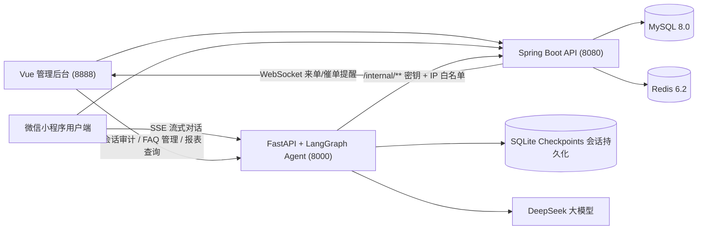
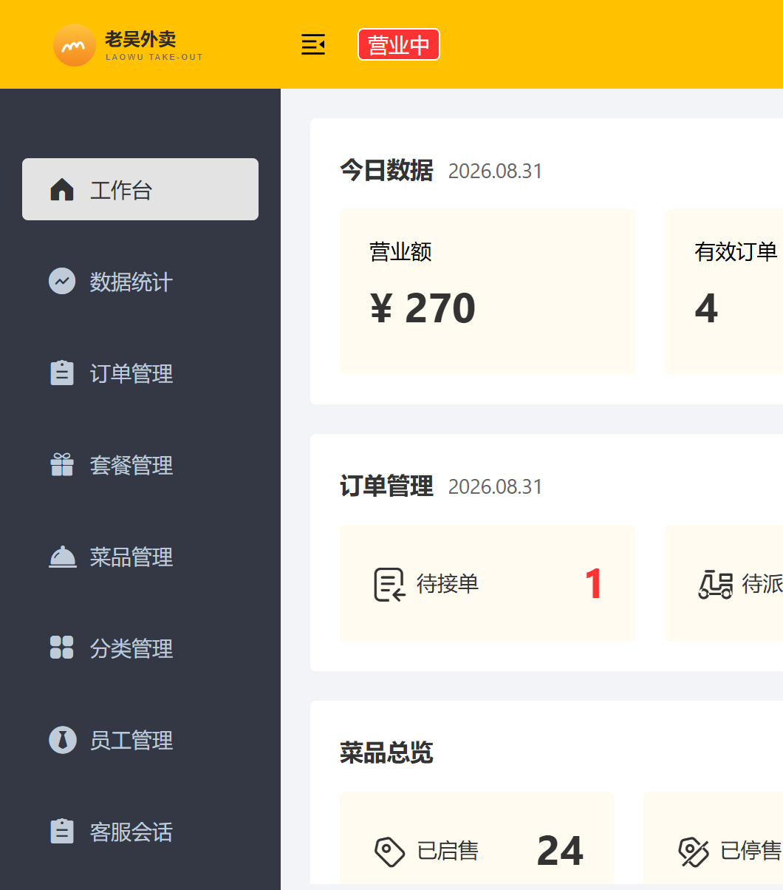
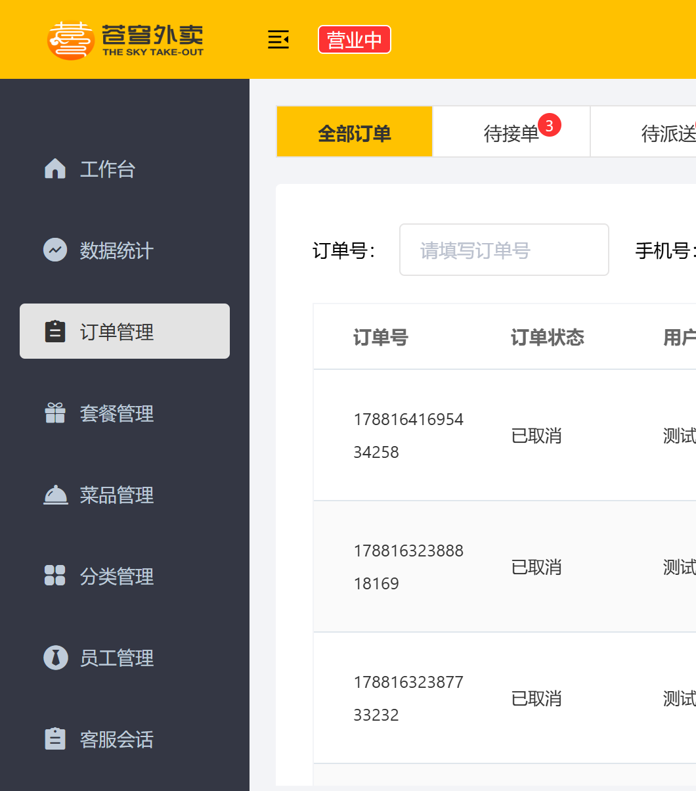
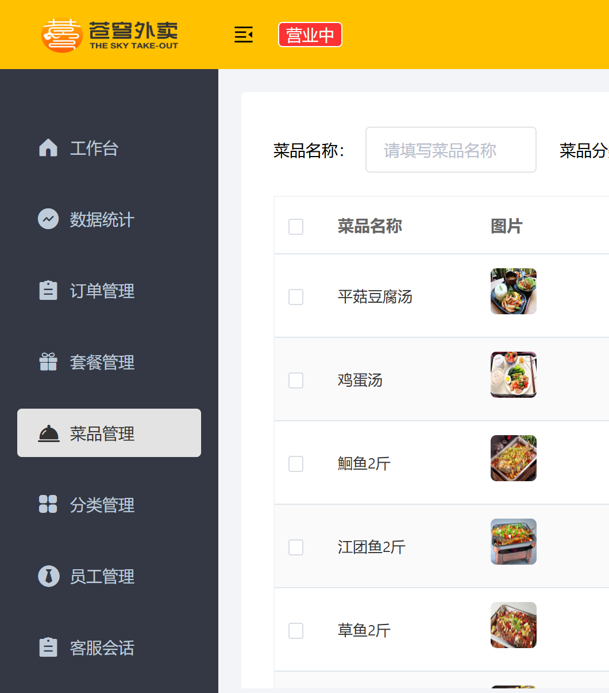
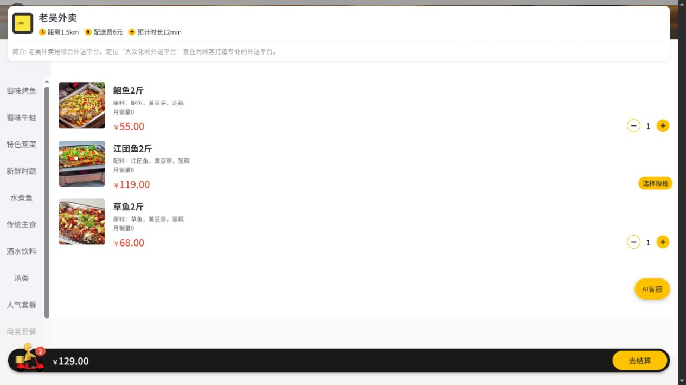
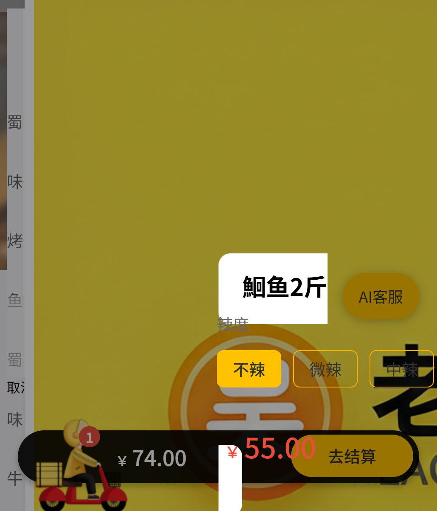
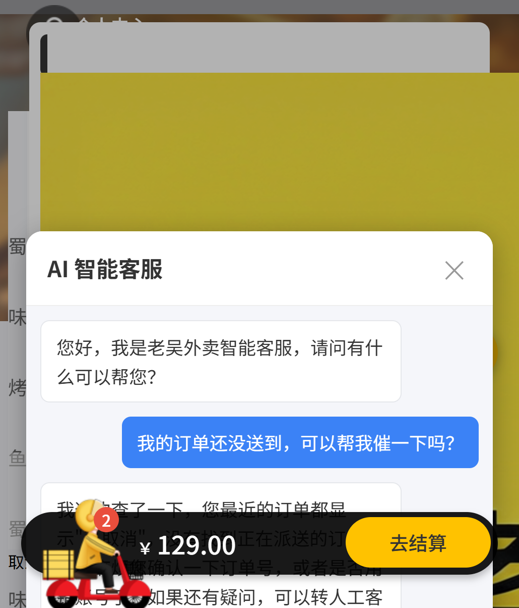

# 老吴外卖：全链路外卖系统 + AI 客服 Agent

一个可完整运行的外卖业务系统：用户端微信小程序、商家管理后台、Spring Boot 后端，加上基于 LangGraph 的 AI 客服。**核心设计是"模型负责理解、代码负责规则"**——AI 客服可以听懂自然语言并调用真实业务接口，但订单归属、状态流转、高风险操作的确认权全部由后端代码强制控制。

## 项目简介

外卖业务的客服场景有大量重复问题（"我的订单到哪了"、"帮我取消订单"、"有什么招牌菜"），人工处理慢且无法 7x24 在线。本项目给外卖系统加了一层 **AI 客服前置层**：用户在小程序里用自然语言提问，Agent 通过内部接口查询真实订单和菜品数据作答；取消订单、申请退款这类写操作必须经过确认节点，用户不点头就不执行。

它不是接入一个聊天窗口的 Demo，而是覆盖"浏览—下单—支付—接单—配送—催单—退款—评价"的完整业务闭环，AI 客服是这个闭环里真实可用的一环。

## 核心特性

- **真实业务闭环**：菜品/套餐/购物车/下单/支付/接单/派送/完成/催单/退款/优惠券/评价，订单状态机集中管理所有合法流转，防止跳步。
- **Agent 工程化**：LangGraph 状态图、SQLite Checkpointer 会话持久化（服务重启不丢会话）、SSE 流式输出、X-Trace-Id 全链路追踪、结构化错误与限流。
- **安全边界**：用户/管理员双 JWT 体系、会话与订单归属由后端校验、`/internal/**` 内部接口密钥 + IP 白名单双重鉴权、高风险操作确认节点（interrupt）、提示词注入防护测试。
- **可观测可运维**：`/health` 与 `/ready` 双探针（Agent 就绪检查覆盖模型配置/后端连通/检查点库）、管理端会话审计、FAQ 知识库后台管理。
- **一键部署**：Docker Compose 编排 MySQL + Redis + 后端 + Agent 四个服务，全部带健康检查和依赖启动顺序。
- **可验证交付**：Agent 38 项 pytest 测试、Java 单元测试（状态机/时间线/密码工具）、管理端 jest 单测，GitHub Actions 四条流水线每次推送自动验证。

## 技术栈

| 模块 | 技术 |
| --- | --- |
| 后端 | Java 8、Spring Boot 2.7、MyBatis、MySQL 8.0、Redis 6.2、Druid、WebSocket、JWT、Knife4j |
| AI 客服 | Python、FastAPI、LangGraph、LangChain、DeepSeek、SQLite Checkpointer、SSE |
| 管理后台 | Vue 2、TypeScript、Element UI、ECharts、Vue CLI |
| 用户端 | uni-app（微信小程序） |
| 支付与三方 | 微信支付 V3、支付宝沙箱、阿里云 OSS、百度地图（配送范围） |
| 部署与 CI | Docker Compose、多阶段构建 Dockerfile、GitHub Actions |

## 系统架构



Agent 不直接碰数据库，所有业务数据和写操作都经过 Spring Boot 后端：查询走只读的 `/internal/**` 聚合接口，催单、取消等动作由后端校验订单归属和状态后执行。LLM 的输出只是"想做什么"，能不能做由代码决定。

## 关键设计决策

1. **为什么 Agent 不直接连数据库，而是走后端内部接口？** 订单归属、状态合法性这些业务规则必须在后端统一保证，AI 绕过后端就等于绕过了规则。`/internal/**` 只暴露聚合好的只读数据，配合密钥和 IP 白名单，把 Agent 的攻击面压到最小。
2. **为什么取消订单、退款必须经过确认节点？** 写操作不可逆，模型可能误判意图或被对话内容诱导。LangGraph 的 interrupt 机制把高风险动作挂起，等用户明确确认后才恢复执行；拒绝则什么都不做。
3. **为什么用户和管理员用两套 JWT？** 两端权限模型完全不同（`token` / `authentication` 两个请求头），密钥分离后任何一端的密钥泄露都不会波及另一端；所有接口再叠加归属校验，防止水平越权查看他人订单。
4. **为什么支付提供 Mock 开关？** 微信/支付宝真实凭证不进仓库，Mock 模式下完整订单链路（下单—支付—接单—退款）在本地和 CI 都能跑通；真实支付代码路径（微信支付 V3、支付宝沙箱、回调处理）完整保留，填上凭证即可切换。
5. **为什么会话持久化选 SQLite？** 单机演示阶段零依赖、可解释；横向扩展场景在"后续方向"中规划迁移 PostgreSQL/Redis 多实例。

## 目录结构

```text
laowu-takeout/
|- sky-take-out/            # Spring Boot 多模块后端 + AI 客服
|  |- sky-common/           # 工具类、常量、异常、支付工具（微信/支付宝）
|  |- sky-pojo/             # 实体、DTO、VO
|  |- sky-server/           # 控制器、业务、定时任务、WebSocket、拦截器
|  |- sky-agent/            # FastAPI + LangGraph AI 客服（独立服务）
|  |- db-init/              # 数据库初始化脚本（Docker 首次启动自动执行）
|  `- docker-compose.yml    # MySQL + Redis + 后端 + Agent 一键编排
|- sky-web/                 # Vue 2 + TypeScript 商家管理后台
|- sky-miniapp/             # uni-app 微信小程序用户端
|- docs/                    # 全链路测试报告等说明材料
`- .github/workflows/       # GitHub Actions CI（四条流水线）
```

后端命令在 `sky-take-out/` 执行，Agent 命令在 `sky-take-out/sky-agent/` 执行，前端命令在 `sky-web/` 执行。

## 快速开始

### 方式一：Docker Compose 一键启动后端 + Agent

电脑已安装并启动 Docker Desktop 后：

```powershell
cd sky-take-out
# 复制 sky-agent/.env.example 为 sky-agent/.env，填入 DEEPSEEK_API_KEY
docker compose --env-file sky-agent/.env up -d --build
```

启动完成后可访问：

- 后端健康检查：http://localhost:8080/health
- 后端接口文档（Knife4j）：http://localhost:8080/doc.html
- Agent 接口文档（Swagger）：http://localhost:8000/docs
- Agent 就绪检查：http://localhost:8000/ready（模型/后端/检查点三项全 true 即就绪）

管理后台和小程序仍在本机启动（见方式二的第 4、5 步）。

### 方式二：完全本机启动

1. **数据库**：`docker compose up -d mysql redis` 只起 MySQL 和 Redis；或使用已有数据库，先导入 `db-init/001-schema.sql`。
2. **后端**：IDEA 运行 `com.sky.SkyApplication`（端口 8080）。
3. **Agent**：

```powershell
cd sky-take-out/sky-agent
Copy-Item .env.example .env    # 编辑 .env，填入 DEEPSEEK_API_KEY
.venv\Scripts\python.exe -m uvicorn app.main:app --port 8000
```

4. **管理后台**：

```powershell
cd sky-web
npm ci
$env:NODE_OPTIONS="--openssl-legacy-provider"
npm run serve
```

打开 http://localhost:8888，使用初始账号 `admin / 123456` 登录。

5. **小程序**：HBuilderX 导入 `sky-miniapp/` 运行到微信开发者工具。开发环境已开启 Mock 登录和 Mock 支付，无需真实微信凭证即可走通全流程。

完整的分步启动、排障和验收记录见 [完整启动与全链路验收](sky-take-out/docs/完整启动与全链路验收.md)。

## API 接口

### AI 客服（sky-agent）

| 方法 | 路径 | 用途 |
| --- | --- | --- |
| `POST` | `/agent/chat` | 客服对话（JWT 用户鉴权、限流、高风险操作返回确认框） |
| `POST` | `/agent/chat/stream` | SSE 流式对话 |
| `GET` | `/agent/sessions` | 当前用户会话列表 |
| `DELETE` | `/agent/sessions/{thread_id}` | 删除会话 |
| `PATCH` | `/agent/sessions/{thread_id}/feedback` | 会话好评/差评反馈 |
| `GET` | `/admin/sessions` · `/admin/sessions/summary` · `/admin/sessions/{thread_id}` | 管理端会话审计：列表、统计摘要、详情 |
| `PATCH` | `/admin/sessions/{thread_id}` | 管理端更新会话（写审计记录） |
| `GET/POST/PUT/DELETE` | `/admin/faq` | FAQ 知识库增删改查 |
| `POST` | `/admin/report-agent/query` | 经营报表查询（营业额/用户/订单/销量 Top10，限定只读指标和日期范围） |
| `GET` | `/health` · `/ready` | 存活探针、就绪探针 |

### 后端（sky-server）

用户端（请求头 `authentication`）：

| 模块 | 主要接口 |
| --- | --- |
| 登录 `/user/user` | 微信登录、令牌刷新（开发环境支持 Mock 登录） |
| 浏览 `/user/category` · `/user/dish` · `/user/setmeal` · `/user/shop` | 分类、菜品、套餐、营业状态与营业时段 |
| 购物车 `/user/shoppingCart` | 添加、减少、清空、查看 |
| 订单 `/user/order` | 下单、支付（支持 Mock）、历史订单、订单详情、订单时间线、取消、再来一单、催单、申请退款、退款进度 |
| 地址 `/user/addressBook` | 增删改查、设置默认地址 |
| 优惠券 `/user/coupon` | 可领列表、领取、我的优惠券 |
| 评价 `/user/comment` | 提交评价、我的评价 |

管理端（请求头 `token`）：

| 模块 | 主要接口 |
| --- | --- |
| 员工 `/admin/employee` | 登录/登出/令牌刷新、员工增删改查、启用禁用、修改密码 |
| 订单 `/admin/order` | 条件搜索、各状态数量统计、详情、时间线、接单/拒单/取消/派送/完成、退款申请列表与审核 |
| 菜品/套餐/分类 | 增删改查、分页、批量删除、起售停售 |
| 报表 `/admin/report` | 营业额/用户/订单统计、销量 Top10、Excel 导出 |
| 工作台 `/admin/workspace` | 今日数据、订单/菜品/套餐总览 |
| 其他 | 优惠券管理、评价列表、配送员管理、店铺营业状态、文件上传 |

系统级：`/health`、`/ready` 探针；`/notify/*` 微信/支付宝支付与退款回调；`/internal/*` Agent 专用内部接口（密钥 + IP 白名单，含用户最近订单聚合、订单时间线、退款进度、店铺信息）。

## 测试与验收

| 层 | 基线 |
| --- | --- |
| AI 客服 | 38 项 pytest 测试：对话安全与会话归属、离线降级、FAQ 检索、报表工具、鉴权 |
| 后端 | JUnit 5 + Mockito：订单状态机、订单时间线服务、密码工具等 |
| 管理后台 | jest 单元测试 + 生产构建验证 |
| 持续集成 | GitHub Actions 四条流水线（Agent 测试 / Java 测试 / 前端构建 / 密钥扫描），每次推送自动运行 |

全链路验收覆盖 60+ 项场景，包括状态机防跳步（待接单直接完成被拒绝）、接口限流生效、催单 WebSocket 实时推送、退款审核后订单自动转已取消、AI 注入防护与高危操作确认框，记录见 [全链路测试报告](docs/全链路测试报告.md)。

本地验证命令：

```powershell
# AI 客服
cd sky-take-out/sky-agent
.venv\Scripts\python.exe -m pytest -q

# 后端
cd ..
mvn test -q

# 管理后台
cd ..\..\sky-web
npm run build
```

## 项目截图

管理后台真实运行截图（本地启动后登录拍摄，页面数据为测试库中的真实订单与菜品）：







用户端小程序（uni-app 编译为 H5 后本地连接真实后端与 AI 客服服务拍摄，分类、菜品、购物车、地址均为数据库真实数据）：

<p align="center">
  
  
  
  
</p>

## 开源基线声明

本项目的基础业务框架来自黑马程序员《苍穹外卖》公开教学项目，课程骨架部分不声称为个人原创；在课程基础上的扩展为个人独立完成：

| 课程提供 | 本项目个人扩展 |
| --- | --- |
| 菜品、套餐、购物车、员工管理等基础业务 | LangGraph AI 客服：对话、确认节点、FAQ 检索、会话审计、报表查询 |
| 订单基础流程 | 订单状态机、订单时间线、催单（WebSocket 实时推送）、完整退款链路 |
| 微信登录/支付骨架 | Mock 开关体系、支付宝沙箱接入、接口限流、双 JWT 安全加固 |
| 管理后台模板 | Agent 会话/FAQ 管理、健康与就绪探针、Docker Compose 一键编排 |
| 基础表结构 | 增量业务表、数据库初始化脚本、GitHub Actions CI 与密钥扫描 |

## 说明

本项目为学习与作品集演示作品，示例配置中的密钥均为占位符，真实凭证通过环境变量注入，不进入仓库。
